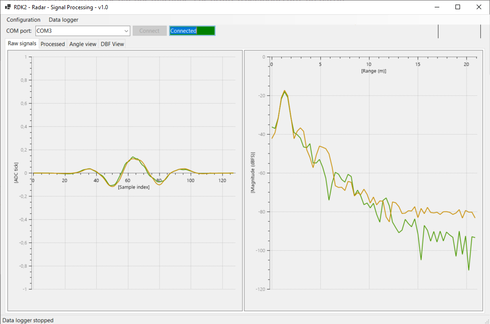

# RDK2 - Digital signal processing using RAB3 Radar and RDK2

This code example demonstrates digital signal processing implemented on computer side to be used with a BGT60TR13C radar sensor from Infineon and a RDK2 development board from Rutronik.

## Requirements

- [ModusToolbox® software](https://www.infineon.com/cms/en/design-support/tools/sdk/modustoolbox-software/) **v3.x** [built with **v3.1**]
- [RAB3-Radar](https://www.rutronik24.com/product/rutronik/rab3radar/23169671.html)
- [RDK2](https://www.rutronik24.fr/produit/rutronik/rdk2/16440182.html)

## Using the code example with a ModusToolbox™ IDE:

The example can be directly imported inside Modus Toolbox by doing:
1) File -> New -> Modus Toolbox Application
2) PSoC 6 BSPs -> RDK2
3) Sensing -> RDK2 RAB3 Radar UBS Gateway

A new project will be created inside your workspace.

To program the RDK2, use the Kit Prog3 USB connector.

## Operation

1) Plug a USB-C connector to the side of the RDK2 and connect the cable to your computer.

2) Start the GUI and click on connect.

3) Press the USER BTN1 on the RDK2 to start the data generation.

Remark: in case no data are received, close the GUI, press the reset button on the RDK2, start the GUI again, press on "Connect" button and then press USER BTN1.

## Change the radar configuration
You can change the radar configuration used to measure by generating a new "radar_settings.h" configuration.

Use the tool provided by Infineon “[Radar Fusion GUI](https://softwaretools.infineon.com/tools/com.ifx.tb.tool.ifxradargui)” to generate a new version of the file.

## Libraries

The project contains a local copy of the sensor-xensiv-bgt60trxx.
Modifications have been made inside the file xensiv_bgt60trxx_mtb.c to detect timeout during SPI transfers.

## Legal Disclaimer

The evaluation board including the software is for testing purposes only and, because it has limited functions and limited resilience, is not suitable for permanent use under real conditions. If the evaluation board is nevertheless used under real conditions, this is done at one’s responsibility; any liability of Rutronik is insofar excluded. 

